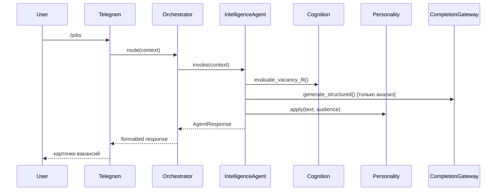

# Intelligence Core (Epic 2)

Ядро интеллекта Ugra — автономный AI-агент с личностью, памятью, целями и инструментами.

## Компоненты

| Компонент | Файл | Ответственность |
|-----------|------|-----------------|
| Agent Runtime | `core/intelligence/agent_runtime.py` | Базовый класс `IntelligenceAgent` |
| Orchestrator | `agents/orchestrator/intelligence_orchestrator.py` | Маршрутизация, цепочки, lifecycle |
| Cognition Engine | `application/intelligence/cognition_engine.py` | Планирование, reasoning, выбор |
| Personality Engine | `application/intelligence/personality_engine.py` | Hunter / Professional |
| Goal Manager | `application/intelligence/goal_manager.py` | Цели пользователя |
| Tool Registry | `core/tools/base.py` | Универсальные инструменты |
| Prompt Manager | `infrastructure/prompts/manager.py` | Версионированные промпты |
| Autonomous Scheduler | `application/autonomous/scheduler.py` | Фоновые задачи |

## Agent Runtime — жизненный цикл

```
invoke(context)
    │
    ├─ detect_audience() → Hunter / Professional
    ├─ set_state(THINKING)
    ├─ align_action() с активной целью
    ├─ execute(runtime_ctx)     ← агент реализует
    ├─ apply_personality()      ← постобработка текста
    └─ set_state(IDLE)
```

### Состояния агента (`AgentState`)

| Состояние | Когда |
|-----------|-------|
| `idle` | Ожидание |
| `searching` | Поиск вакансий |
| `thinking` | Анализ, принятие решения |
| `writing` | Генерация текста |
| `learning` | Обучение |
| `waiting` | Ожидание внешнего ответа |
| `sleeping` | Агент остановлен |
| `running_tool` | Выполнение инструмента |
| `error` | Ошибка |

Состояние публикуется через событие `AgentStateChanged` и доступно в API `GET /api/v1/agents/state`.

## Cognition Engine

**Владеет интеллектом.** LLM вызывается только для `plan_actions()`.

### Детерминированная логика (без LLM)

- `evaluate_vacancy_fit()` — порог match score, игнор компаний
- `select_resume()` — пересечение skills с technologies вакансии
- `summarize_memory()` — сводка памяти для контекста

### Internal Reasoning

Каждое решение → `ReasoningRecord`:

```python
ReasoningRecord(
    agent_name="career_agent",
    category=ReasoningCategory.VACANCY_SELECTION,
    decision="skip",
    rationale="Company 'BadCorp' is in ignore list",
    confidence=1.0,
)
```

Доступ: `GET /api/v1/reasoning/{user_id}`

## Orchestrator

```python
orchestrator.route(context)           # авто-выбор агента
orchestrator.invoke_agent(name, ctx)  # явный вызов
orchestrator.execute_chain(user_id, steps)  # цепочка действий
orchestrator.plan_and_execute(user_id)      # план + выполнение
```

### ActionStep

```python
ActionStep(agent_name="career_agent", action="search jobs")
ActionStep(tool_name="job_search", parameters={"filters": {...}})
```

## Autonomous Tasks

При `AUTONOMOUS_ENABLED=true` scheduler запускает каждые N секунд:

1. `search_vacancies` — поиск и публикация VacancyFound
2. `analyze_new_vacancies` — анализ через career_agent
3. `study_market_requirements` — learning_agent
4. `update_statistics` — обновление статистики
5. `check_new_messages` — проверка сообщений

## Диаграмма потока сообщения


